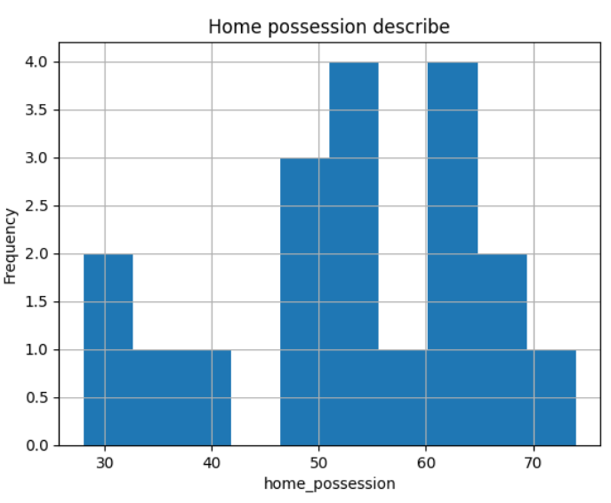
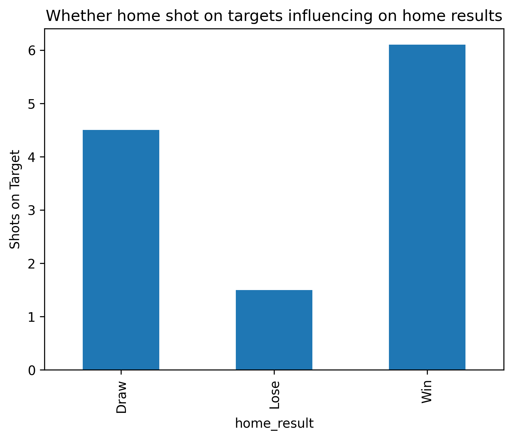
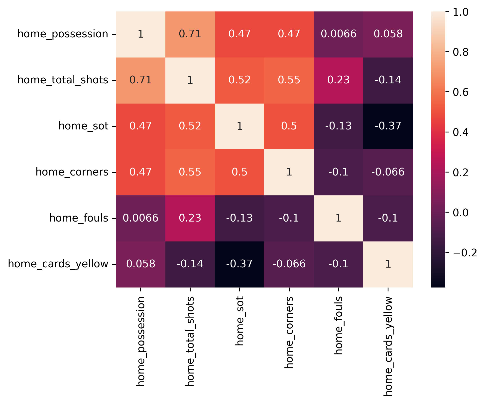
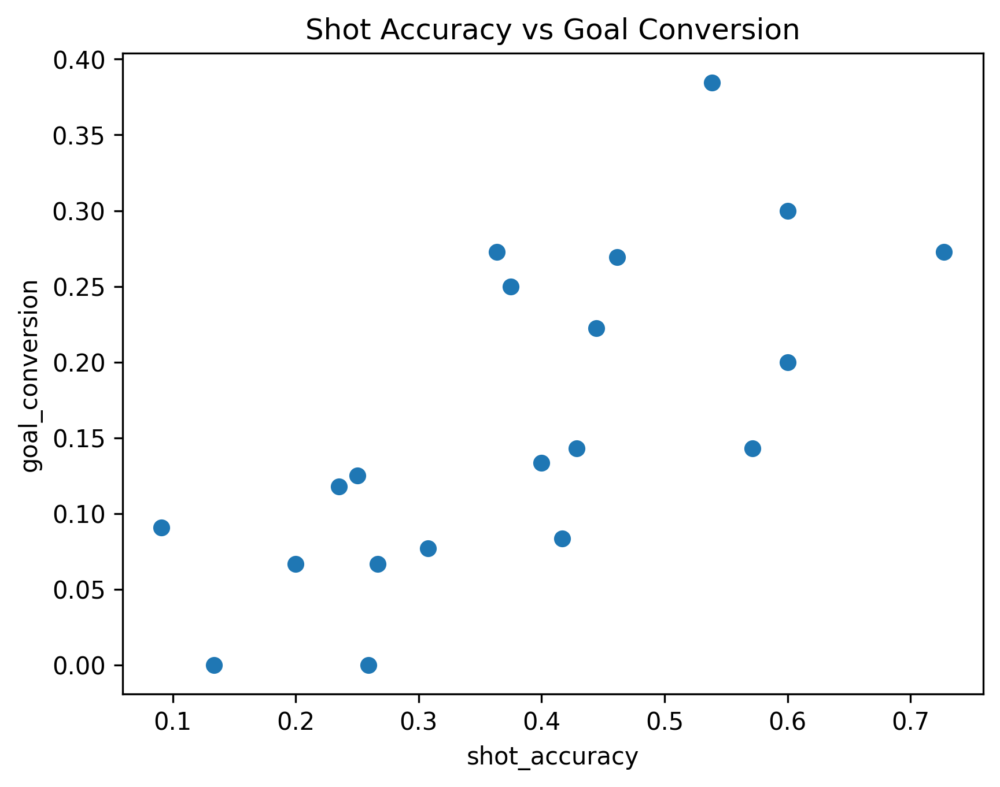

# Dataset

This project uses the FIFA Match, Player and Team Dataset from Kaggle.

Source:

https://www.kaggle.com/datasets/wasiqaliyasir/fifa-match-player-and-team-dataset-2026

Files used in this project:

- matches.csv

The dataset contains:

- Match results
- Possession
- Shots
- Fouls
- Cards
- Attendance
- Team information

Visualisations

Home Possession

Winning teams generally maintained higher ball possession.

Shots on Target

Shots on target showed the largest difference between winning and losing teams.

Heatmap

Correlation analysis between key performance indicators.

Scatter

Positive relationship between shot accuracy and goal conversion.

The original dataset belongs to the dataset author on Kaggle.

Due to licensing considerations, the raw dataset is not included in this repository.
